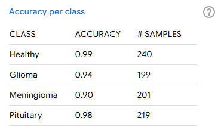

# 🩺 HealthAI

A full-featured health app offering tools for personal health tracking and AI-powered brain tumor detection.

- ✅ **MedLog** – Log and manage health metrics, medications, and treatments  
- 🧠 **TumorSense** – Detect brain tumors from MRI scans using AI (TensorFlow)

📱 Built with **Thunkable** (mobile), **Flask API** (backend), and **React + Vite** (web).  
🔐 User authentication and data storage powered by **Firebase**.

---

## 🚀 Live Links

- 📱 **Mobile App Demo Video** – [Watch here](#) *(insert YouTube or Drive link)*
- 🌐 **TumorSense Web App** – [https://health-ai-seven.vercel.app/](https://health-ai-seven.vercel.app/)
- 🔗 **API Endpoint** – [https://api-6903.onrender.com/predict](https://api-6903.onrender.com/predict)

---

## 🧰 Tech Stack

| Layer         | Stack                                    |
|---------------|-------------------------------------------|
| Frontend (Mobile) | Thunkable                             |
| Frontend (Web) | React + Vite (hosted on Vercel)          |
| Backend       | Flask (Python), Render Web Service        |
| ML Model      | TensorFlow, Teachable Machine (TFLite)    |
| Image Uploads | Cloudinary                                |
| User Data     | Firebase (Auth + Firestore DB)            |

---

## 🧠 TumorSense – AI Brain Tumor Detection

TumorSense allows users to upload MRI images and get instant predictions using a lightweight AI model trained on brain tumor scans.

## 🧠 Model Details:

-Model Type:     Convolutional Neural Network (TFLite)
-Framework:      TensorFlow + Teachable Machine
-Input Size:     224 x 224 pixels
-Input Format:   Grayscale MRI scan
-Inference Time: ~0.3 seconds (on Render’s 0.1 CPU, 512MB RAM)

---

### 📊 Model Accuracy Graphs

### 📊 Model Accuracy Per Epoch  
  

### 📊 Model Loss Per Epoch  
  

### 📊 Accuracy by Class  


### 📋 MedLog – Health Tracker:

- MedLog is the personal health section of the app, allowing users to:
- Enter general health data (symptoms, vitals, etc.)
- Track medications (name, dosage, frequency)
- Log ongoing or past treatments
- Securely save all data using Firebase Firestore
- Authenticate with Firebase Auth (email or Google login)

---

### 📱 Mobile Version (Thunkable)

- User uploads an MRI image from their phone
- App uploads it to **Cloudinary**
- It retrieves the image URL and sends it via a `POST` request to the Flask API
- The API responds with a diagnosis and confidence score

---

### 🧪 API: `/predict`

**POST /predict**

```json
{
  "image_url": "https://link-to-mri-image.jpg"
}
```

### ✅ Sample Response:
```json
{
  "class": "Healthy",
  "confidence": 0.99897472321
}
```

### 🌐 Web Version (React + Vite, hosted on Vercel)

- Same workflow as the mobile app
- Users can upload MRI images directly from the browser
- Backend interaction via the same Flask API on Render

> 🔗 **Try it now**: [TumorSense Web App](https://your-vercel-app-url.vercel.app)

---

### 🙋‍♂️ Developed And Documented By
Goutham Krishna D
Student @ Indian School Al Seeb, Muscat, Oman
---

